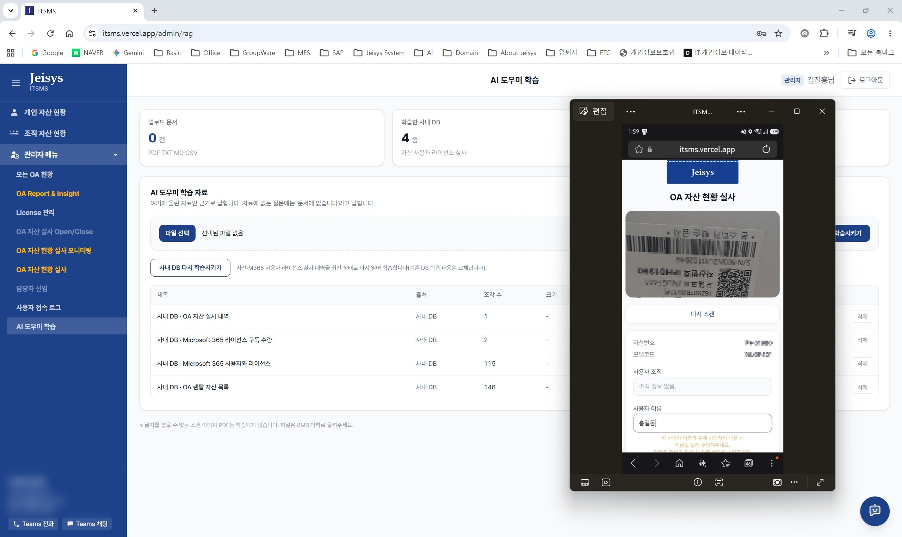
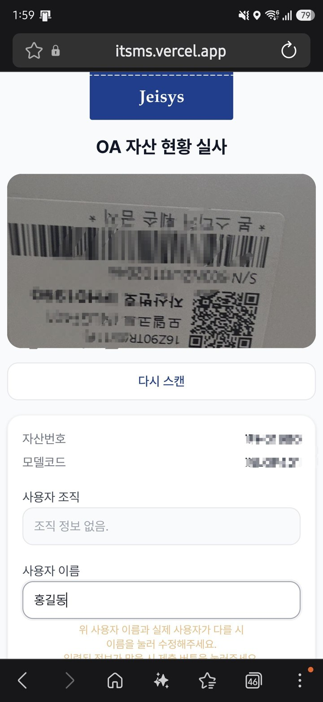

# ITSMS — 사내 IT 서비스 관리 시스템

[](https://github.com/devjinhong-del/itsms/actions/workflows/ci.yml)


흩어져 있던 사내 IT 자산·계정·라이선스를 한 곳에서 보고, **자산 실사는 휴대폰 카메라로** 끝내는 사내 전용 웹 서비스입니다.

**배포 주소** · https://itsms.vercel.app (사내 계정 로그인 필요)

> AI 바이브 코딩 교육 과제로 진행했습니다. 기획(PRD) → 설계(DESIGN) → 계획(PLAN) → 구현 → 검증을 AI와 함께 반복해 **3일 만에** 실제 운영 데이터(자산 1,010대 · 계정 1,097개)가 도는 시스템까지 만들었습니다.

---

## 왜 만들었나

IT 담당자가 "이 노트북 누가 쓰고 있죠?"라는 한 줄짜리 질문에 답하려면 **네 개 시스템을 번갈아 열어 대조**해야 했습니다.

| 어디에 | 무엇이 |
|---|---|
| 렌탈사이트(KRS) | 장비·계약·렌탈료 |
| Microsoft 365 | 계정·소속·보유 라이선스 |
| 요청서 문서 | 서비스·변경·데이터 요청 |
| 담당자의 기억 | 실제로 누가 쓰는지 |

그래서 현황은 실시간이 아니고, 실사는 종이와 엑셀로 하고, **쓰지 않는 장비의 렌탈료가 계속 나가고 있었습니다.**

## 무엇을 하나

**모아서 쌓고 → 현장에서 확인하고 → 한 화면에서 본다.**

### 1. 휴대폰 바코드 실사 `/audit_oa`
카메라로 자산 바코드를 비추면 자산번호·모델코드를 읽어 **사용자와 소속을 자동으로 채웁니다.** 실제 사용자가 다르면 그 자리에서 고쳐 제출하고, 고쳤다는 사실(`is_edited`)까지 남습니다. 촬영한 실물 사진은 비공개 스토리지에 저장돼 증빙이 됩니다.

### 2. 역할별 대시보드
| 화면 | 보이는 사람 | 내용 |
|---|---|---|
| 개인 자산 현황 | 전원 | 내 장비·라이선스·실사 상태 |
| 조직 자산 현황 | 담당자↑ | 우리 조직 구성원별 보유 현황 |
| 모든 OA 현황 | 관리자 | 전사 장비 분포와 자산 목록 검색 |
| **OA Report & Insight** | 관리자 | 퇴사자 명의·계약종료 잔존·중복 보유·만료 임박 자산을 **자동으로 추려 절감액 제시** |
| License 관리 | 관리자 | 구독 수량 대비 사용률, 조직별 할당 현황 |
| 실사 모니터링 | 관리자 | 진행률, 부서별 순위, 실사 사진 |
| 사용자 접속 로그 | 관리자 | 로그인·화면 이동 기록 |

> 실제 성과: 퇴사자 명의로 남아 있던 장비 **47대**를 찾아냈습니다. 회수하면 **연 1,327만 원** 절감입니다.

### 3. AI 도우미 (RAG)
올린 문서와 사내 DB(264개 조각)만 근거로 답합니다. **자료에 없으면 지어내지 않고 "문서에 없습니다"라고만 답합니다.** 근거 문서 제목을 출처로 함께 보여줍니다.

```
Q. 자산번호 IFH01990 은 누가 쓰고 월 렌탈료는 얼마인가요?
A. 김진홍님이 사용 중이며, 월 렌탈료는 103,000원입니다.   [출처: 사내 DB · OA 렌탈 자산 목록]

Q. 우리 회사 창립기념일은 언제인가요?
A. 문서에 없습니다.
```

## 화면

### 관리자 화면 — AI 도우미 학습 자료 관리
왼쪽은 역할에 따라 달라지는 사이드바, 가운데는 학습시킨 자료 목록(사내 DB 4종 · 264개 조각), 오른쪽 아래는 언제든 부를 수 있는 AI 도우미 버튼입니다. 겹쳐 띄운 창은 같은 시각 휴대폰에서 돌아가는 실사 화면입니다.



### 휴대폰 실사 — 바코드를 비추면 정보가 채워집니다
자산 태그를 인식하면 화면이 멈추고 자산번호·모델코드가 잡히며, 사용자 정보가 자동으로 들어옵니다. 실제 사용자가 다르면 이름을 눌러 고친 뒤 제출합니다.



> 이미지의 자산번호·사내 연락처는 가렸습니다.

## 어떻게 만들었나

### 아키텍처

```
휴대폰/PC 브라우저
      │
      ▼
Next.js 16 (App Router)          ← Vercel 배포
  ├─ middleware.ts               로그인 확인 · 모바일이면 실사 화면으로
  ├─ 서버 컴포넌트/서버 액션      권한 확인 후 데이터 조회 (service_role)
  └─ 클라이언트 컴포넌트          바코드 스캔, 표 검색, 챗봇 UI
      │
      ▼
Supabase                          Postgres · Auth · Storage · pgvector
      ▲                               ▲
      │ REST(service_role)            │ 임베딩·답변
      │                               │
Python 수집 배치                   OpenAI API
  ├─ export_OA      KRS 자산 API    text-embedding-3-small
  └─ export_m365    M365 CSV        gpt-4o-mini
```

### 기술 선택과 이유

| 선택 | 이유 |
|---|---|
| **Next.js (App Router)** | 화면과 서버 로직을 한 프로젝트에서. 서버 컴포넌트라 대외비 데이터가 브라우저로 내려가지 않음 |
| **Supabase** | DB·로그인·파일 저장·벡터 검색(pgvector)을 한 서비스로 해결 — 별도 ORM·인증 라이브러리 없음 |
| **@zxing/browser** | 앱 설치 없이 브라우저 카메라만으로 바코드 인식 |
| **OpenAI gpt-4o-mini** | 사내 문서 응답에 충분하면서 비용이 가장 낮은 조합 |
| **Python 수집 배치 분리** | 수집 주기(1시간)와 웹앱 배포 주기가 달라서, 화면을 고치지 않고 수집만 따로 돌릴 수 있게 |

### 데이터 관리 원칙 — 지우지 않는다

모든 원천 표(`krs_*`, `m365_*`, `audit_oa`)는 **SCD2** 방식입니다. 값이 바뀌면 기존 행을 만료 처리(`expired_at` = 현재시각)하고 새 행을 추가하며, 유효한 행은 `9999-12-31 23:59:59`로 표시합니다. **"언제 무엇이 어떻게 바뀌었는지"가 항상 남습니다.**

### 보안

- 모든 표에 **RLS**를 켜고, 조회는 권한을 확인한 **서버 코드만** 수행합니다
- 역할 3단계: `general` ⊂ `manager` ⊂ `admin` — 메뉴를 숨기는 데 그치지 않고 **페이지에서도 다시 검사**합니다
- 키·개인정보는 코드에 넣지 않고 **환경변수로만** 다룹니다 ([`.env.example`](.env.example) 참고)
- 실사 사진은 **비공개 버킷** + 만료되는 서명 URL로만 열람합니다

## AI와 어떻게 일했나 (교육 과제 회고)

문서를 먼저 쓰고(PRD → DESIGN → PLAN), 작업 단위마다 **`lint` → `build` → 브라우저 확인**을 반복했습니다. 프로젝트 규칙은 [`CLAUDE.md`](CLAUDE.md)에 적어 AI가 매번 같은 기준으로 움직이게 했습니다.

AI가 만든 결과를 그대로 믿지 않고 확인했기 때문에 잡아낸 문제들입니다.

| 증상 | 실제 원인 | 어떻게 찾았나 |
|---|---|---|
| 계정 1,091개 중 **512개만 생성**됨 | PostgREST가 한 번에 1,000행만 반환 — 나머지가 **오류 없이 조용히** 누락 | "왜 z0e 계정이 없지?"라는 질문에서 시작해 원본 행 수(2,233)와 대조 |
| 아이폰에서 카메라 권한창이 아예 안 뜸 | 라이브러리에 요청을 맡기면 사용자 제스처 컨텍스트를 잃음 | 실기기 테스트 → 버튼 클릭 흐름 안에서 `getUserMedia` 직접 호출로 변경 |
| 화면 시각이 9시간 빠름 | Vercel 서버가 UTC — 시간대를 지정하지 않은 포맷 | "오늘 실사" 집계까지 틀어진 걸 확인하고 KST 고정 |
| 챗봇 학습이 중간에 실패 | 표를 줄 단위로 적은 글이 한 덩어리로 뭉쳐 임베딩 길이 초과 | 오류 메시지 추적 → 분할 로직 수정, **이후 단위 테스트로 재발 방지** |
| 자산번호로 물으면 "문서에 없습니다" | 의미 검색만으로는 식별자를 못 잡음 | 본문 일치 검색을 함께 쓰도록 보완 |

마지막 항목처럼, **테스트가 실제로 버그를 잡았습니다.** `splitIntoChunks`에 경계 테스트를 넣자 조각 하나가 한도를 1글자 넘기는 문제가 드러나 고쳤습니다.

## 실행하기

```bash
git clone https://github.com/devjinhong-del/itsms.git
cd itsms
npm install
cp .env.example .env     # 값을 채웁니다
npm run db:migrate       # db/migrations/*.sql 적용
npm run dev              # http://localhost:3000
```

| 명령 | 하는 일 |
|---|---|
| `npm run dev` | 개발 서버 |
| `npm run dev:https` | HTTPS 개발 서버 — 휴대폰 카메라 테스트용(`getUserMedia`는 보안 컨텍스트 필요) |
| `npm run lint` | ESLint |
| `npm test` | 단위 테스트 (24개) |
| `npm run build` | 프로덕션 빌드 |
| `npm run db:migrate` | SQL 마이그레이션 적용 |
| `npx tsx scripts/sync-roles.ts` | 역할 정리 — 기본은 미리보기, `--apply`로 반영 |

데이터 수집 배치(웹앱과 분리, 따로 실행):

```bash
cd export_m365 && python sync_m365.py           # M365 사용자·라이선스
cd export_m365 && python sync_m365_license.py   # 라이선스 구독 수량
cd export_OA   && python sync.py                # KRS 렌탈 자산
```

## 폴더 구조

```
src/
  app/
    (main)/         로그인 후 화면 (사이드바 레이아웃 공유)
      admin/        관리자 전용 화면
    audit_oa/       모바일 자산 실사
    login/          로그인
  components/       대시보드 공통 UI, 사이드바, 화면별 클라이언트 컴포넌트
  lib/
    auth/           역할 위계와 접근 제어
    db/             Supabase 클라이언트, 페이징 헬퍼
    rag/            챗봇 — 임베딩, 검색, 답변 규칙, 학습 자료 적재
tests/              단위 테스트 (순수 함수)
db/migrations/      SQL 마이그레이션 (번호 순서대로 실행)
export_OA/          KRS 자산 수집 배치 (Python)
export_m365/        M365 사용자·라이선스 수집 배치 (Python)
scripts/            마이그레이션·계정 생성·역할 정리 (TypeScript)
```

## 문서

| 문서 | 내용 |
|---|---|
| [PRD.md](PRD.md) | 추진 배경, 현행 한계, 주요 기능, 범위/비범위, 보안 검토 |
| [DESIGN.md](DESIGN.md) | 화면 구성, 데이터 모델, 데이터 흐름, 기술 선택 이유 |
| [PLAN.md](PLAN.md) | 작업 순서와 진행 상태 |
| [CLAUDE.md](CLAUDE.md) | AI와 함께 일할 때의 프로젝트 규칙(언어·검증 루프·비밀 정보 관리) |

## 라이선스

[LICENSE](LICENSE) — 사내 시스템 구현물로, 학습·참고 목적의 열람만 허용합니다.
