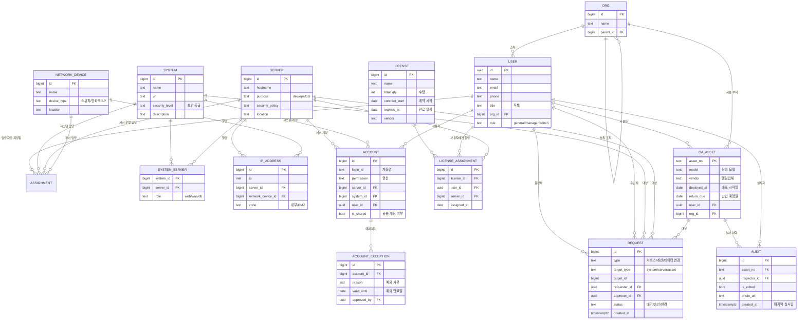

# ITSMS 데이터 관계도 (확장 설계)

지금 구현된 표(자산·계정·라이선스·실사)에 **시스템·서버·네트워크·계정·결재**를 더해 ITSMS 전체를 담았을 때의 데이터 구조입니다. 아직 구현 전이며, 앞으로 만들 순서를 잡기 위한 설계도입니다.

## 1. 이 구조가 풀어야 할 화면 흐름

> 시스템을 검색한다 → 그 시스템이 쓰는 **서버 목록**이 보인다 → 서버를 누르면 **IP·보안등급·사용 계정·예외처리·담당자**가 나온다 → 담당자를 누르면 **어느 조직 누구인지, 연락처**가 나온다.

이 흐름이 조인 한 줄로 풀리려면, 화면마다 표를 따로 두는 게 아니라 **사람(user)과 조직(org)을 중심에 두고 나머지가 그걸 참조**해야 합니다. 담당자는 시스템에도, 서버에도, 네트워크 장비에도 붙기 때문입니다.

## 2. 관계도



## 3. 표별 역할과 지금 상태

| 표 | 무엇을 담나 | 지금 상태 |
|---|---|---|
| `ORG` | 조직(본부·실·팀) 계층. 자기 자신을 참조해 상위 조직을 표현 | m365_users의 division/office/team을 표로 승격해야 함 |
| `USER` | 사람 한 명. 이름·소속·직책·이메일·연락처 | **구현됨** (`profiles` + `m365_users`) |
| `SYSTEM` | 사내 시스템. 이름·URL·보안 등급 | 신규 |
| `SERVER` | 서버. 용도(dev/ops/DB)·보안 정책 | 신규 |
| `NETWORK_DEVICE` | 스위치·방화벽 등 네트워크 장비 | 신규 |
| `SYSTEM_SERVER` | **시스템 ↔ 서버 N:M 연결** | 신규 |
| `IP_ADDRESS` | IP 한 개. 서버 또는 네트워크 장비에 붙음 | 신규 |
| `ACCOUNT` | 서버·시스템에 로그인하는 계정과 권한 | 신규 |
| `ACCOUNT_EXCEPTION` | 계정 예외처리(사유·만료일·승인자) | 신규 |
| `LICENSE` | 라이선스 종류·수량·계약 기간 | **부분 구현** (`m365_license_total` — M365만) |
| `LICENSE_ASSIGNMENT` | 라이선스를 누구/어느 서버에 줬는지 | **부분 구현** (`m365_users.license`) |
| `OA_ASSET` | OA 장비(자산번호·모델·렌탈업체·반납예정일) | **구현됨** (`krs_rental_equipment`) |
| `AUDIT` | 실사 이력. 마지막 실사일은 여기서 계산 | **구현됨** (`audit_oa`) |
| `REQUEST` | 서비스·개선·데이터 변경 요청과 결재 상태 | 신규 |
| `ASSIGNMENT` | **담당자 지정** — 누가 무엇의 담당인지 | 신규 |

## 4. 설계할 때 정한 것 세 가지

**① 담당자는 표마다 칼럼으로 두지 않고 `ASSIGNMENT` 하나로 모읍니다.**

시스템 담당자, 개발 담당, 서버 운영 담당자, 장비 담당 — 같은 사람이 여러 역할을 겸하고, 역할 종류도 계속 늘어납니다. 표마다 `manager_id`를 두면 담당자가 바뀔 때 고쳐야 할 곳이 흩어집니다.

```
ASSIGNMENT
  target_type : system | server | network_device | oa_asset
  target_id   : 대상 id
  user_id     : 담당자
  role        : 시스템담당 | 개발담당 | 운영담당 | 보안담당
  valid_from / valid_to  (담당 이력이 남는다)
```

이렇게 두면 **"이 사람이 담당하는 것 전부"** 와 **"이 서버의 담당자 이력"** 을 같은 표에서 뽑습니다.

**② 시스템과 서버는 N:M입니다.**

한 시스템이 웹·WAS·DB 서버 여러 대를 쓰고, 한 서버에 여러 시스템이 올라가기도 합니다. `SYSTEM_SERVER`에 `role`(web/was/db)을 함께 둬서 "이 서버가 이 시스템에서 무슨 역할인지"까지 남깁니다.

**③ 라이선스는 "사용자에게"와 "서버에" 둘 다 붙습니다.**

M365처럼 사람에게 주는 것도 있고, DB·모니터링처럼 서버에 물리는 것도 있습니다. `LICENSE_ASSIGNMENT`에 `user_id`와 `server_id`를 모두 두고 **둘 중 하나만 채우는 방식**으로 한 표에서 다룹니다. 수량 대비 사용률은 `LICENSE.total_qty`와 할당 건수를 비교해 계산합니다(지금 License 관리 화면과 같은 방식).

## 5. 화면 흐름이 어떻게 풀리는지

| 화면 동작 | 조회 경로 |
|---|---|
| 시스템 검색 → 서버 목록 | `SYSTEM` → `SYSTEM_SERVER` → `SERVER` |
| 서버 상세: IP | `SERVER` → `IP_ADDRESS` |
| 서버 상세: 사용 계정·예외처리 | `SERVER` → `ACCOUNT` → `ACCOUNT_EXCEPTION` |
| 서버 상세: 사용 License | `SERVER` → `LICENSE_ASSIGNMENT` → `LICENSE` |
| 서버 상세: 담당자 | `SERVER` → `ASSIGNMENT` → `USER` |
| 담당자 클릭 → 조직·연락처 | `USER` → `ORG` |
| 담당자가 맡은 것 전부 | `USER` → `ASSIGNMENT` → 각 대상 |
| 사용자 상세: 보유 장비·라이선스 | `USER` → `OA_ASSET`, `LICENSE_ASSIGNMENT` |
| 장비 상세: 마지막 실사일 | `OA_ASSET` → `AUDIT` (가장 최근 `created_at`) |
| 결재 목록 | `REQUEST` → 요청자·승인자(`USER`), 대상(system/server/asset) |

## 6. 만들 순서 제안

1. **`ORG` 승격** — 지금 문자열로 들고 있는 조직을 표로 만든다. 나머지 전부가 이걸 참조하므로 먼저.
2. **`SYSTEM` + `SERVER` + `SYSTEM_SERVER` + `ASSIGNMENT`** — 위 화면 흐름의 뼈대. 여기까지면 "시스템 → 서버 → 담당자" 탐색이 된다.
3. **`ACCOUNT` + `ACCOUNT_EXCEPTION` + `IP_ADDRESS`** — 서버 상세를 채운다.
4. **`LICENSE` 일반화** — M365 전용이던 라이선스를 모든 라이선스로 넓히고 `LICENSE_ASSIGNMENT`로 통합.
5. **`REQUEST`** — 결재 흐름. 승인 주체·결재선이 정해진 뒤에.
6. `NETWORK_DEVICE` — 네트워크 장비 목록이 정리되면.

모든 신규 표도 기존 표와 같은 원칙을 따릅니다 — **값이 바뀌면 지우지 않고 만료 처리(SCD2)**, **RLS를 켜고 서버 코드로만 조회**.
